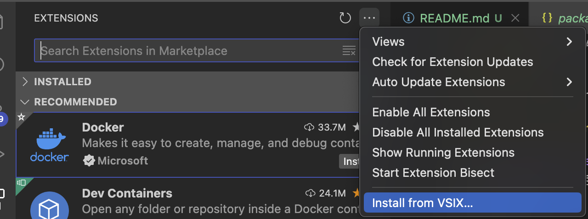
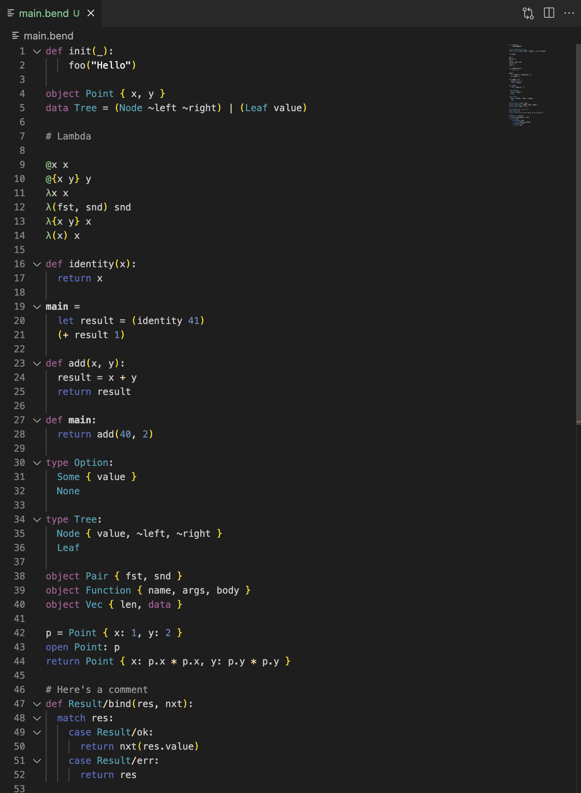

# Bend VSCode syntax highlighting

Basic syntax highlighting for the Bend language.

## Building and installing extension locally

From [publishing an extension](https://code.visualstudio.com/api/working-with-extensions/publishing-extension):

I. Build package binary:
```sh
npx --package @vscode/vsce -- vsce package --allow-missing-repository --skip-license --no-rewrite-relative-links
```

This will create a `bend-<version>.vsix` file.

II. Install locally:

Within VSCode, navigate to
`Extensions > ... > Install from VSIX...` and select the VSIX file outputted from the previous step.



## Custom colors example

Example found in [settings.json](examples/settings.json):


